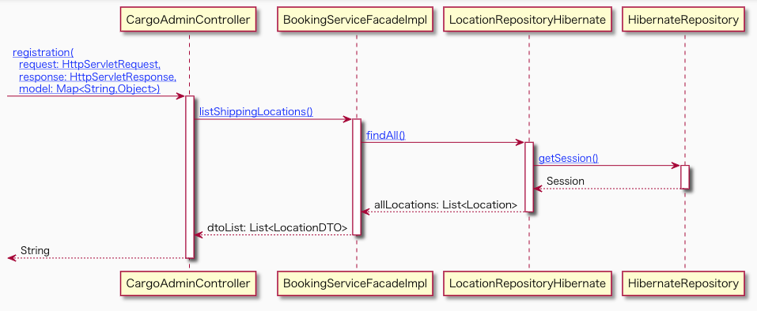
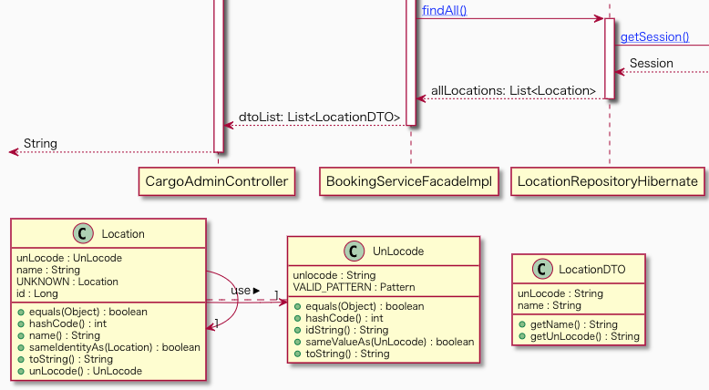
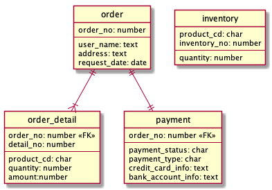

# コード駆動設計

---

### 目次

- はじめに
- 環境の準備
- Code Visualizer でソースコードを読む
- ドメイン駆動設計
- コード駆動設計
- Code Visualizer でコード駆動設計を実践
- まとめ
- 補足

---

### はじめに

**このワークショップでは**

<a href="https://github.com/sitoolkit/sit-cv" target="cv">SI-Toolkit Code Visualizer</a>(以降 CV とも表記)を用いて
コード駆動設計(ソースコードを書きながら設計する手法)を説明・実践します。

**前提知識・経験**

UML(シーケンス図、クラス図)が読めること

Java を用いた Web アプリケーション開発の経験

---

## 環境の準備

---

### ソフトウェアのインストール

ハンズオンでは以下のソフトウェアが必要です。

- <a href="https://docs.aws.amazon.com/ja_jp/corretto/latest/corretto-11-ug/downloads-list.html" target="jdk">JDK 11</a>
- <a href="https://git-scm.com/downloads" target="git">Git</a>
- Java 対応の IDE
  - <a href="https://www.eclipse.org/downloads/" target="eclipse">Eclipse</a>, <a href="https://www.jetbrains.com/idea/" target="intellij">IntelliJ IDEA</a>, <a href="https://code.visualstudio.com/" target="vscode">Visual Studio Code</a>等
- <a href="https://maven.apache.org/" target="maven">Maven</a>
- macOS の場合
  - <a href="http://www.graphviz.org/download/" target="graphviz">Graphviz</a>

それぞれリンク先のガイダンスに従いダウンロード・インストールしてください。
Maven は mvn コマンドが有効となるように環境変数の設定まで実施してください。

---

## Code Visualizer の使い方

### ソースコードを読む

---

### CV を動かす

コマンドプロプト(Windows) / ターミナル(macOS)で以下のコマンドを実行してください。

```sh
cd /path/to/your/workspace

git clone https://github.com/citerus/dddsample-core.git
cd dddsample-core

# Windows
start http://repo1.maven.org/maven2/io/sitoolkit/cv/sit-cv-app/1.0.0-beta.5/sit-cv-app-1.0.0-beta.5-exec.jar
move %USERPROFILE%\Downloads\sit-cv-app-1.0.0-beta.5-exec.jar .

# macOS
curl -o sit-cv-app-1.0.0-beta.5-exec.jar -G http://repo1.maven.org/maven2/io/sitoolkit/cv/sit-cv-app/1.0.0-beta.5/sit-cv-app-1.0.0-beta.5-exec.jar

# Windows, macOS
java -jar sit-cv-app-1.0.0-beta.5-exec.jar
```

ブラウザが起動し CV が生成したページが表示されます。

---

### 解説

CV は、プロジェクト内の java ファイルを解析して
シーケンス図(振る舞いモデル)とクラス図(構造モデル)を生成します。

前ページで git clone したリポジトリは
<a href="https://github.com/citerus/dddsample-core" target="dddsample">DDD Sample</a>
というドメイン駆動設計(Domain Driven Design, DDD)のサンプル実装のプロジェクトです。

プロジェクト内には貨物の航路情報を管理する Web アプリケーションが実装されています。

---

### CV が生成するシーケンス図

<div style="font-size:0.7em;">

シーケンス図は**エントリーポイント**単位に生成され、
**エントリーポイント**を持つクラスのライフラインが左端に配置されます。

**エントリーポイント**はアプリケーションの動作の起点となるメソッドで、
デフォルトの設定では Controller クラスの public メソッドです。

<div>



---

### CV が生成するシーケンス図

シーケンス図にライフラインとして描画されるクラスは、
デフォルトの設定では **Service**、**Repository**、**Factory**、**Specification** クラスです。

これらは**ドメイン駆動設計**で提唱された振る舞いを担う主要なステレオタイプです。

---

### CV が生成するクラス図

<div style="font-size:0.8em;">

CV が生成するシーケンス図の下にはクラス図が表示されます。

クラス図に表示されるのは、シーケンス図内の**メッセージの引数のクラス**、及び**戻り値のクラス**と、
それらの**フィールド**に使用されているクラスです。

</div>



---

### その他の CV の機能

**Live Reload**

CV が起動した状態で java ファイルを変更して保存すると、変更は即座にページに自動反映されます。

**レポート出力**

--cv.report を付けて CV を起動すると、シーケンス図、クラス図が docs/desingdoc 以下に出力されます。

```sh
java -jar sit-cv-app-1.0.0-beta.5-exec.jar --cv.report

start docs¥designdoc¥index.html # Windows

open docs/designdoc/index.html # macOS
```

出力されたファイルは GitHub Pages や Web サーバーにホスト出来ます。

---

## ドメイン駆動設計

---

### ドメイン駆動設計 要約 (1/3)

ドメイン駆動設計は、システムのドメイン(業務領域や専門分野)の概念・用語を設計・実装に反映させることで
高品質なシステムの開発を目指す設計手法です。

ドメインロジックの設計・実装を業務の表現に近づけるための
クラス分類や責務割当の方法についても言及されています。


---

### ドメイン駆動設計 要約 (2/3)

ドメイン駆動設計の重要な指針に、クラスの責務をステレオタイプによって分類するというものがあります。

<div style="font-size:0.6em;">

**主要なステレオタイプとその責務**

| ステレオタイプ | 責務                                          |
| -------------- | --------------------------------------------- |
| Service        | 単位業務処理(トランザクション等)の フロー制御 |
| Entity         | 業務データの格納、データモデルの具象          |
| Repository     | データ永続化機構(DB 等)へのアクセス           |
| Factory        | Entity の生成・組立て                         |
| Specification  | 業務仕様で定められた判定ロジック              |

</div>

---

### ドメイン駆動設計 要約 (3/3)

ステレオタイプをクラスとして実装する際の配置・単位はおよそ以下の様になります。

<div style="font-size:0.6em">

| ステレオタイプ | パッケージ  | クラスの単位 | メソッドの単位        |
| -------------- | ----------- | ------------ | --------------------- |
| Controller     | interfaces  | 画面         | ユーザーアクション    |
| Service        | application | ドメイン     | 単位業務処理          |
| Entity         | domain      | テーブル     | -                     |
| Repository     | domain      | テーブル     | SQL の実行            |
| Factory        | domain      | Entity       | Entity の生成パターン |
| Specification  | domain      | 業務仕様     | 業務仕様              |

</div>

---

### ドメイン駆動設計と Code Visualizer

ドメイン駆動設計や他の一般的な設計手法では、
エントリーポイントを起点とする一連の**処理は複数のクラスに分散**して実装されます。

その結果、ソースコードから**処理全体の流れがわかりにくく**なることもあります。

CV を使うと、この分散した実装を一**連の処理として可視化して俯瞰**することが出来ます。

---

## コード駆動設計

---

### コード駆動設計

コード駆動設計(Code Driven Desing, CDD)はソースコードで処理設計をするという手法です。

ソースコードを適切に可視化することで**設計書の作成・保守コストの削減**を図ります。

また、オブジェクト間の相互作用で処理全体を設計するため**ソースコードの可読性の向上**が期待できます。

---

### コード駆動設計

ソースコードの基本的な実装順序とドメイン駆動設計で該当するステレオタイプは以下の通りです。

1. 処理フローを担うクラスとそのメソッドを実装
   - Controller、Service
2. 上記メソッドの引数・戻り値となる、データの格納を担うクラスを実装
   - Entity
3. データ加工を担うクラスとそのメソッドを実装　ただしメソッドはシグニチャのみで中は実装しない
   - Repository、Factory、Specification

この作業を、画面仕様やデータモデルを精緻化させながら繰り返します。

---

### コード駆動設計 作業の流れ(1/3)

例として、オンラインストアの注文を確定する処理を実装します。

以下の様なユースケース記述が定義されいているとします。

**ユースケース記述**

1. ユーザーが「注文確定」ボタンをクリックする。
2. 画面に「注文を受け付けました。」というメッセージと「注文番号」が表示される。

これをドメイン駆動設計に従ってコード駆動設計します。

---

### コード駆動設計 作業の流れ(2/3)

OrderService クラスと order メソッドを実装します。

```java
public class OrderService {

  OrderRepository orderRepository;

  public String order(OrderEntity order) {
    // TODO 注文番号の採番
    order.setOrderNumber("")
    orderRepository.save(order);

    return order.getOrderNumber();
  }
}
```

注文を確定するので、注文情報を DB に保存するための Repository の呼び出しを実装します。
注文番号を採番したいのですが、ここでは TODO としておきます。

---

### コード駆動設計 作業の流れ(3/3)

OrderServcie.order メソッドの実装で、新たに OrderEntity と OrderRepository が登場したので実装します。

```java
public class OrderEntity {
  private String orderNumber;
  // setter , getter
}
```

```java
public class OrderRepository {
  public void save(Order order) {
    // TODO impl
  }
}

```

Repository のメソッドの内部は実装せずに、TODO タグを書いておきます。

---

## Code Visualizer で

## コード駆動設計を実践

---

### 題材 (1/3)

CV を使って以下の機能を設計・実装します。

**システム**

オンラインストア

**機能**

注文の確定処理 (REST API)

**ユースケース記述**

1. ユーザーが「注文確定」ボタンをクリックする。
2. 画面に「注文を受け付けました。」というメッセージと「注文番号」が表示される。

<p style="font-size:0.6em;text-align:left;">
前提　この時点でユーザーはカートへの商品追加、および送付先住所・支払方法の入力をしているものとします。
<p>

---

### 題材 (2/3)

**仕様**

- 注文番号は以下の仕様に従う。
  - 書式は　注文確定処理時点のタイムスタンプ(yyMMddhhmm) + 連番(5 桁 0 パディング)とする。
  - 連番は DB のシーケンスオブジェクトから採番する。
- 在庫は古い順(inventory_no が小さい順)に販売する。
- 支払方法はクレジットカード、代金引換が選択できる。
  - クレジットカードの場合は外部サービス(REST API)を呼び出して決済する。


---

### 題材 (3/3)

**データモデル**

データモデルは以下の様なものを検討しているとします。



これら以外のテーブル・仕様も実際のオンラインストアの運営を想定しながら自由に設計してみてください。

---

### 作業の流れ

1. プロジェクト作成
2. プロジェクトに CV を適用、実行
3. コード駆動設計の手順に従いクラス・メソッドを実装

**ポイント**

Controller、Service のみメソッドの中身を実装します。

Factory、Specivication はメソッドのシグニチャのみを実装し、
期待する振る舞いを Javadoc に記載します。

---

### プロジェクト作成 (1/2)

以下のコマンドを実行します。

```sh
cd /path/to/your/workspace

mkdir cdd-project
cd cdd-project

# Windows
mkdir src¥main¥java¥a¥b¥c

# macOS
mkdir -p src/main/java/a/b/c
```

以降ではsrc/main/java/a/b/c以下に必要なJavaパッケージ、クラスを作成するものとします。

---

### プロジェクト作成 (2/2)

cdd-projectディレクトリにpom.xmlファイルを作成し、以下の内容を貼り付けて保存します。

```xml
<project xmlns="http://maven.apache.org/POM/4.0.0" xmlns:xsi="http://www.w3.org/2001/XMLSchema-instance" xsi:schemaLocation="http://maven.apache.org/POM/4.0.0 http://maven.apache.org/xsd/maven-4.0.0.xsd">
  <modelVersion>4.0.0</modelVersion>

  <groupId>a.b.c</groupId>
  <artifactId>cdd-project</artifactId>
  <version>1.0.0-SNAPSHOT</version>

  <properties>
    <project.build.sourceEncoding>UTF-8</project.build.sourceEncoding>
    <maven.compiler.source>11</maven.compiler.source>
    <maven.compiler.target>11</maven.compiler.target>
  </properties>

</project>
```

---

### Code Visualizer のインストール・起動

以下のコマンドを実行します。

```sh
cd cdd-project

# Windows
start http://repo1.maven.org/maven2/io/sitoolkit/cv/sit-cv-app/1.0.0-beta.5/sit-cv-app-1.0.0-beta.5-exec.jar
move %USERPROFILE%\Downloads\sit-cv-app-1.0.0-beta.5-exec.jar .

# macOS
curl -o sit-cv-app-1.0.0-beta.5-exec.jar -G http://repo1.maven.org/maven2/io/sitoolkit/cv/sit-cv-app/1.0.0-beta.5/sit-cv-app-1.0.0-beta.5-exec.jar

# Windows,macOS
java -jar sit-cv-app-1.0.0-beta.5-exec.jar
```

ブラウザが開き、Code Visualizer のページが表示されます。

---

### REST API の実装

CV でエントリーポイントとなる Controller から実装します。
以下のクラスを作成してください。

```java
package a.b.c.interfaces;

// @Path("/order")    JAX-RSの場合
//   or
// @RestController("/order")    Spring MVCの場合
public class OrderController {

  // @Get   JAX-RSの場合
  //   or
  // @GetMapping    Spring MVCの場合
  public OrderResponseDto order(OrderRequestDto request) {

  }
}
```
OrderRequestDto・OrderResponseDtoはREST APIのリクエスト・レスポンスのデータを格納するクラスです。
これらのクラスも同一パッケージ内に作成してください。

---

## それでは

## 作業を始めてください

---

## まとめ

---

### まとめ

* CVは処理全体を**主要クラス間のメッセージのやり取り**として可視化します。
* この視点は**クラスの責務割当**や**メソッドのシグニチャ**の妥当性を判断するためにとても重要です。
* コード駆動設計はこれらを**メソッドの中身を実装する前に最適化**を試みるアプローチです。

---

### 補足　CRUD マトリクス

CV は起動時に--cv.analyze-sql オプションを付与すると、
縦:エントリーポイント x 横:テーブルの CRUD マトリクスを生成します。

```bat

java -jar sit-cv-app-1.0.0-beta.5-exec.jar --cv.analyze-sql


```

<div style="font-size:0.8em;">

|              | table_1 | table_2 |
| ------------ | :-----: | :-----: |
| entryPoint_1 |   CU    |         |
| entryPoint_2 |   RU    |    C    |

<p style="font-size:0.6em;text-align:left;">
※CRUDマトリクスは、mvn testでログ出力されるSQLをもとに生成されます。
つまり、CRUDマトリクスを生成するにはRepositoryの単体テストが実装されている必要があります。
<p>

</div>

---

### ご清聴ありがとうございました。

### ハンズオンお疲れさまでした。
