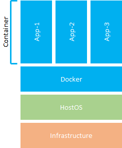

# Docker入門

# ハンズオン

---

### このハンズオンは

**対象者**

Dockerを使ったことがない人

**前提知識**

CLI操作の基礎

**目標**

構成要素の概念を理解する  
基本操作を身に付ける  
コンテナの用途を理解する  
イメージ・composeの作成ができる  

---

### 目次

- はじめに
- Dockerとは
- ハンズオン：Dockerの基本操作
- コンテナの用途
- ハンズオン：イメージ・composeの作成
- まとめ

---

### はじめに

#### 株式会社モノクレア
- SIプロジェクトの技術コンサルティング
 - アプリケーションアーキテクチャ
 - 開発方法論
 - テスト自動化
 - CI/CD

---

## Dockerとは

---

### Dockerとは

Dockerとは、コンテナと呼ばれる仮想環境を提供するプラットフォームです。  

<div style="float:left; width:50%">



</div>

<div style="font-size:0.7em; float:right; width:50%">

HostOS上にDockerエンジンを起動し、Dockerエンジンが各種アプリケーションを実行するコンテナを管理します。  
一般的な仮想環境に比べ、リソース共有化による軽量動作、ポータビリティに優れた仮想環境を構築することができます。  
Docker仮想環境は、イメージ、コンテナ、ボリュームで構成されます。

</div>

---

### 構成要素 - イメージ

イメージとは、Dockerコンテナを起動させるベースとなるものです。  
イメージは継承が可能で、OSだけのイメージ > アプリケーションをインストールしたイメージ、
のように継承して作成することが可能です。  
Dockerエンジンにインストールされているイメージは下記コマンドで確認することができます。

```
$ docker images
```

不要となったイメージは下記コマンドで削除することができます。

```
$ docker rmi [イメージID]  # イメージの削除
```

---

### 構成要素 - コンテナ

コンテナとは、Dockerイメージをもとに作成された仮想環境です。
コンテナは下記コマンドで起動・停止を行います。

```
$ docker run [イメージ名]                  # イメージからコンテナを生成して起動
$ docker start [コンテナID or コンテナ名]  # 生成済みのコンテナを起動
$ docker stop [コンテナID or コンテナ名]   # コンテナを停止
```

作成されたコンテナは下記コマンドで確認できます。

```
$ docker ps     # 稼働中のコンテナを表示
$ docker ps -a  # 停止中も含む、すべてのコンテナを表示
```

また、不要となったコンテナは下記コマンドで削除することができます。

```
$ doker rm [コンテナID]
```

---

### 構成要素 - ボリューム

コンテナに保存したデータはコンテナの削除に合わせて消えてしまいますが、
アプリ設定ファイル・DB等のデータを永続化したい場合、ボリュームを使用します。  
ボリュームはPCやサーバーにおける外部ストレージのような役割を果たします。    
ボリュームを使用する場合はコンテナ起動時にオプションで指定します。

```
$ docker run [イメージ名] -v /local:/container  # ホストOSの/localをボリュームとしてコンテナの/containerにマウントして起動
$ docker run [イメージ名] -v volume:/container  # volumeというボリュームを作成してコンテナの/containerにマウントして起動
```

作成されたボリュームは以下のコマンドで確認、削除することができます。

```
$ dokcer volume ls                 # ボリュームを表示
$ dokcer volume rm [ボリュームID]  # ボリュームを削除
```

---

## ハンズオン

## Dockerの基本操作

---

### Dockerの基本操作(1/3)

Dockerで主に使用するコマンドを紹介します。

・コンテナを起動

```
$ docker run -d [イメージ名 or コンテナ名]
$ docker start [コンテナ名]
-d：デタッチド・モード
```

・コンテナの停止

```
$ docker stop [コンテナ名]
```

・コンテナ起動状態の確認

```
$ docker ps
$ docker ps -a  # 停止状態のコンテナも表示
```

---

### Dockerの基本操作(2/3)

・コンテナのログを確認

```
$ docker logs -f [コンテナID]
-f：ログの出力をフォロー（ctrl+cで停止）
```

・コンテナへのコマンド実行

```
$ docker exec [コンテナID] [実行コマンド]
$ docker exec -it [コンテナID] [作業シェル]  # コンテナのシェルにログイン
-i：アタッチしていなくてもSTDINをオープンにし続ける
-t：疑似ターミナルの割り当て
```

・コンテナ・ホストOS間ファイルコピー

```
$ docker cp /local/file [コンテナID]:/container/path  # ホストOSのファイルをコンテナにコピー
$ docker cp [コンテナID]:/container/file /local/path  # コンテナのファイルをホストOSにコピー
```
---

### Dockerの基本操作(3/3)

・イメージ操作

```
$ docker images            # イメージの表示
$ docker rmi [イメージID]  # イメージの削除
```

・ボリューム操作

```
$ docker volume ls                 # ボリュームの表示
$ docker volume rm [ボリュームID]  # ボリュームの削除
```

・ポート連携

```
$ docker run -d -p [ホストOS側ポート]:[コンテナ側ポート] [コンテナID]
-p：コンテナのポートまたはポート範囲をホスト側に公開する
```

・コンテナ削除

```
$ docker rm [コンテナID]
```
---

### ハンズオン(1/4)

1. HTTPサーバーをバックグラウンドで起動する。  
使用するイメージ - nginx:alpine  
任意のポートにコンテナの80ポートを連携
1. コンテナの状態を確認する。
1. ログを表示した状態でHTTPサーバーにアクセスする。  
アクセスログを確認後、ログの表示を停止する。
1. HTTPサーバーのシェル(sh)にログインして、ドキュメントルートに任意のHTMLファイルを作成する。  
ブラウザから作成したHTMLファイルにアクセスする。  
(ドキュメントルート：/usr/share/nginx/html)
1. ホストOSで任意のHTMLファイルを作成してドキュメントルートにコピーする。  
ブラウザから作成したHTMLファイルにアクセスする。

---

### ハンズオン(2/4)

1. HTTPサーバーを停止、コンテナを削除する。
1. HTTPサーバーをバックグラウンドで起動する。  
使用するイメージ - nginx:alpine  
任意のポートにコンテナの80ポートを連携
1. 先ほど作成したWebページへアクセス、ページが存在しないことを確認する。

---

### ハンズオン(3/4)

1. HTTPサーバーを停止、コンテナを削除する。
1. HTTPサーバーをバックグラウンドで起動して、ドキュメントルートにボリュームをマウントする。  
使用するイメージ - nginx:alpine  
任意のポートにコンテナの80ポートを連携
1. HTTPサーバーのシェル(sh)にログインして、ドキュメントルートに任意のHTMLファイルを作成する。  
ブラウザから作成したHTMLファイルにアクセスする。  
1. HTTPサーバーを停止、コンテナを削除する。
1. HTTPサーバーを同条件で起動する。  
1. ブラウザから作成したHTMLファイルにアクセスする。

---

### ハンズオン(4/4)

1. HTTPサーバーを停止する。
1. コンテナの状態を確認する。(-a有無での表示を確認)
1. コンテナを削除して状態を再確認する。
1. イメージの状態を確認、削除して状態を再確認する。
1. ボリュームの状態を確認、削除して状態を再確認する。

---

## コンテナの用途

---

### コンテナの用途

Dockerではコンテナをサーバーとして使用する以外に、単独処理を行うこともできます。

・サーバー用  
ハンズオンではAlpineLinux:Nginxで構成されたHTTPサーバーを仮想環境として起動しました。  
ハンズオンで触ったように、通常のサーバーと同様にログインしての作業以外にも、
コンテナの外からファイル転送やログの確認などもできます。  
HTTPサーバー以外にも、DBやLDAP、SMTPなど、様々なイメージが
[DockerHub](https://hub.docker.com/)に用意されています。

---

### コンテナの用途

・単独処理用  
docker runで**--rm**オプションを指定すると、コンテナ終了時にコンテナを自動的に削除することができます。
このオプションを利用することで、サーバーとしてではなく、コンテナを使用して単独処理を行うことができます。

例）ボリュームのバックアップ(弊社プロダクト[sit-ds](https://github.com/sitoolkit/sit-ds)で使用)

```
docker run --rm \                                     # --rmオプションを指定してコンテナ起動
  -v ${volume_name}:/target \                         # バックアップするボリュームをコンテナ：/targetにマウント
  -v ${LOCAL_BACKUP_DIR}:/backup \                    # ホストOSのバックアップ先ディレクトリをコンテナ：/backupにマウント
  ubuntu \                                            # ubuntuイメージを使用
  tar cfz /backup/${volume_name}.tar.gz -C /target .  # tarコマンドで/targetディレクトリを/backupにバックアップ
```

---

## ハンズオン

## イメージ・Composeの作成

---

### イメージの作成

<div style="font-size:0.8em;">

Dockerイメージは、Dockerfileを用意することで自分で作成することができます。  
イメージの作成には**Dockerfile**を作成する必要があります。  
以下、nginxにbashをインストール、独自ページを追加するDokcerfileの例です。

```
FROM nginx:alpine                      # 継承元のイメージを指定
RUN apk add bash                       # コマンドを実行(本例ではbashを追加でインストール）
ADD mypage.html /usr/share/nginx/html  # ファイルを追加
CMD ["nginx", "-g", "daemon off;"]     # コンテナ起動時のコマンドを指定
```
※参考：[Dockerfileリファレンス](http://docs.docker.jp/engine/reference/builder.html)

Dockerfileを作成したら、以下のコマンドでイメージを作成することができます。


```
$ docker build -t [REPOSITORY:TAG] [Dockerfile配置ディレクトリ]
※-tオプションは任意のため指定しなくてもよいが、
ランダムなイメージIDで識別が必要になるので、オプションの使用を推奨
REPOSITORY：リポジトリ名、nginx:alpineの場合のnginxにあたる
TAG：タグ、nginx:alipineのalpineにあたる
```

</div>

---

### Composeの作成

Composeとは、複数のDockerコンテナを使用するDockerアプリケーションを実行するツールです。  
アプリケーションの定義には、docker-compose.ymlファイルを作成する必要があります。  
参考：[Composeファイルリファレンス](http://docs.docker.jp/compose/compose-file.html)

作成したdocker-compose.yml定義のアプリケーションは、以下のコマンドで起動します。

```
$ docker-compose up -d
※docker-compose.yml配置ディレクトリで実行
```

docker-composeが実行できるコマンドは概ねdockerコマンドと同様です。    
参考：[docker-composeコマンド概要](http://docs.docker.jp/compose/reference/overview.html)

---

### ハンズオン(1/2)

#### Dockerイメージの作成
  
以下のイメージを作成する。
* ベースイメージ - nginx:alpine
* 独自のページを事前に追加する
* Listenポートを8080とし、コンテナへの解放ポートも8080とする  
* docker run -d -p 8080:8080 [イメージ]でコンテナを起動、http://localhost:8080/[任意ページ] でアクセスを確認

---

### ハンズオン(2/2)

#### Composeの作成

<div style="font-size:0.8em;">

以下のComposeを作成する。
* ベースイメージ1 - httpd:alpine
 * 独自のページを事前に追加する
 * httpdのListenポートを8080とし、直接アクセスはできない設定とする

* ベースイメージ2 - nginx:alpine
 * nginxのListenポートを80として、/へのアクセスをhttpd:8080へproxyする設定ファイルを追加する
 * 直接アクセスできる設定とする

* 動作確認
 * http://localhost:8080/[任意ページ] → アクセスNG
 * http://localhost/[任意ページ] → アクセスOK

</div>

---

## まとめ

---

### まとめ

* Dockerとはイメージからコンテナを起動する仮想環境プラットフォーム  
ボリュームを使用してデータの永続化が可能
* 単独処理/サーバー
 * オプションの指定で、単独処理の実行後にコンテナ自動削除
 * 永続化によりアプリケーションサーバーの提供が可能
* Dockerfileによる独自イメージの作成が可能
* Composeによる複数コンテナが連携するDockerアプリケーションの作成が可能
 * 弊社プロダクト[sit-ds](https://github.com/sitoolkit/sit-ds)もComposeで実装
 * Jenkins, Redmine, Gitbucket, Sonarqubeのアセット
 * LDAPによる認証、SelfServicePasswordによるPW管理
 * バックアップ・リストアシェルを用意

---

### ご清聴ありがとうございました。

### ハンズオンお疲れさまでした。