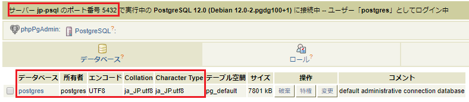

# Docker入門

# ハンズオン

---

### 目次

- はじめに
- 環境の準備
- Dockerの構成要素
- ハンズオン：Dockerの基本操作
- コンテナの用途
- コンテナ同士の連携
- Docker Compose
- ハンズオン：Composeの作成
- まとめ

---

### はじめに

**このワークショップでは**

Dockerの基本的な使い方から実践的な使い方までをハンズオン形式で解説します。

**対象者**

Dockerを使ったことがない人

**前提知識**

コマンドプロンプト(Windows) / ターミナル(macOS) の基本的な操作方法

---

### 環境の準備

ハンズオンでは以下のソフトウェアが必要です。

* Docker
 * Windows Home  
   <a href="https://docs.docker.com/toolbox/toolbox_install_windows/" target="docker-toolbox">Docker Toolbox</a>
 * Windows Pro  
   <a href="https://docs.docker.com/docker-for-windows/install/" target="docker-desktop-win">Docker Desktop for Windows</a>
 * Mac  
   <a href="https://docs.docker.com/docker-for-mac/install/" target="docker-desktop-mac">Docker Desktop for Mac</a>

* <a href="https://code.visualstudio.com/" target="vscode">Visual Studio Code</a>

---

### 表記

本書では「以下のコマンドを実行してください」と表記することがあります。
その場合は、以下の通りOSごとのコマンドラインツールで記載された実行してください。

* Windows Home  
  Docker Quickstart Terminal
* Windows Pro  
  コマンドプロンプト
* macOS  
  ターミナル


---


## Dockerの構成要素

---

### コンテナを動かす

以下のコマンドを実行してください。


```sh

docker run -d --name pg postgres


```

これで、DockerでPostgreSQLサーバーが起動しました。

---

### コンテナの中に入る

以下のコマンドを実行してください。

```sh
docker exec -it pg bash
# コンテナのOSのプロンプト
root@21321a7c78f9:/# 
```

新しいプロンプトが始まります。これはコンテナのOS(Linux)のプロンプト(bash)です。
psqlコマンドを実行すると、PostgreSQLに接続することができます。

```sh
psql -U postgres
# 出力
psql (12.1 (Debian 12.1-1.pgdg100+1))
Type "help" for help.

postgres=#
```
---

### コンテナとは

**コンテナ**とは、要するに**サーバー**です。
**docker run**コマンドを使うと、PC内にサーバーを起動することができます。
以下のコマンドで実行中のコンテナの一覧が確認できます。

```sh
docker ps
# 出力
CONTAINER ID        IMAGE               COMMAND                  CREATED             STATUS              PORTS               NAMES
c715a39f1989        postgres            "docker-entrypoint.s…"   8 minutes ago       Up 8 minutes        5432/tcp            pg
```

---

### イメージの作成(1/3)

前述の**docker run**コマンドは<a href="https://hub.docker.com/_/postgres" target="postgres-dockerhub">Docker Hub</a>
で公開されているPostgreSQLの**Dockerイメージ**でコンテナを起動しています。

**Dockerイメージ**は公開されているイメージをカスタマイズして作ることもできます。

以下のコマンドを実行し、jp-pgディレクトリとDockerfileファイルを作成してください。

```sh
# Docker Toolboxは事前に以下を実施
cd ${HOME}

# 共通
mkdir jp-pg
cd jp-pg
code Dockerfile
```

---

### イメージの作成 (2/3)

VSCodeがDockerfileを開いたら以下の内容を貼り付けてください。

```docker

FROM postgres
RUN localedef -i ja_JP -c -f UTF-8 -A /usr/share/locale/locale.alias ja_JP.UTF-8
ENV LANG ja_JP.utf8


```

---

### イメージの作成 (3/3)

Dockerfileを保存し、以下のコマンドを実行してください。

```sh

docker build -t jp-pg .


```

これで、**ロケールを日本に変更したPostgreSQL**のイメージが作成できました。

---

### 作成したイメージでコンテナを起動

以下のコマンドでコンテナを起動してください。

```sh

docker run -d --name jp-pg jp-pg


```

コンテナが起動したら、以下のコマンドを実行してください。

```sh
docker exec -it jp-pg bash
# コンテナのプロンプトで
psql -U postgres
# 出力
psql (12.1 (Debian 12.1-1.pgdg100+1))
"help"でヘルプを表示します。

postgres=#
```

ログインメッセージが日本語になっています。

---

### イメージとは

**イメージ**は、要するに**サーバーのインストールメディア**です。

イメージを作っておけば、OSやアプリケーションがセットアップされた状態のコンテナを即座に作成することができます。

```sh
docker images
# 出力
REPOSITORY          TAG                 IMAGE ID            CREATED             SIZE
jp-pg               latest              a78ef5e0a592        36 seconds ago      398MB
postgres            latest              9eb7b0ce936d        2 days ago          394MB
```

---

### ボリュームのマウント(1/4)

コンテナとホストOS間でファイルをやり取りするためには、**ボリューム**を使用します。

以下のコマンドを実行し、initdbディレクトリとinitialize.sqlを作成してください。


```sh

cd ..
mkdir initdb
code initdb/initialize.sql


```

---

### ボリュームのマウント(2/4)

VSCodeがinitialize.sqlを開いたら以下の内容を貼り付けてください。

```sql

CREATE USER myuser;
CREATE DATABASE mydb;
GRANT ALL PRIVILEGES ON DATABASE mydb TO myuser;


```

このSQLスクリプトは上から順に、ユーザーの作成、DBの作成、作成したユーザーにDBへの全権限の付与を行います。

---

### ボリュームのマウント(3/4)

initialize.sqlを保存し、以下のコマンドでコンテナを起動してください。

```sh
# コマンドプロンプト(Windows Pro)
docker run -d --name mnt-pg -v %cd%/initdb:/docker-entrypoint-initdb.d -v pg_data:/var/lib/postgresql/data jp-pg

# Docker Quickstart Terminal(Windows Home)
docker run -d --name mnt-pg -v ${HOME}/initdb:/docker-entrypoint-initdb.d -v pg_data:/var/lib/postgresql/data jp-pg

# ターミナル(macOS)
docker run -d --name mnt-pg -v ${PWD}/initdb:/docker-entrypoint-initdb.d -v pg_data:/var/lib/postgresql/data jp-pg
```

---

### ボリュームのマウント(4/4)

以下のコマンドを実行してください。

```sh
docker exec -it mnt-pg bash
# コンテナのプロンプトで
psql -U myuser mydb
# 出力
psql (12.1 (Debian 12.1-1.pgdg100+1))
"help"でヘルプを表示します。

mydb=>
```

ホストOSで作成した初期化SQLファイルがコンテナで実行されて、myuserでmydbにログインできます。

---

### ボリュームとは

**ボリューム**とは、要するに**外付け記憶媒体**です。

ボリュームをコンテナにマウント(接続)することで、
コンテナ内に外部からデータを持ち込んだり、コンテナ内のデータを外部に持ち出すことができます。

---

### ボリュームの使い方(1/2)

ボリュームをマウントするには、docker runに**"-v [ホストOSのパス or 任意の名称]:[コンテナのパス]"**オプションを指定します。

* ホストOSのパスを指定  
コンテナからホストOSのパスを参照することができます。  
つまり、ホストOSとコンテナの共有ディレクトリのように使用することができます。

---

### ボリュームの使い方(2/2)

* 任意の名称を指定  
指定した名称のボリューム(**NamedVolume**)が作成されます。  
NamedVolumeはホストOSからファイル操作ができないので、データを安全に保存することができます。  
作成したNamedVolumeは以下のコマンドで確認できます。
```sh
docker volume ls
# 出力
DRIVER              VOLUME NAME
local               pg_data
```

---

## ハンズオン
## Dockerの基本操作

---

### 課題

以下の課題を通してDockerの基本操作を学びます。

* コンテナのログを表示する

* コンテナの任意のファイルをホストOSにコピーする

* ホストOSで任意のファイルを作成し、コンテナへコピーする

* bashを経由せずに、コンテナのPostgreSQLにログインする

* pg、jp-pg、mnt-pgコンテナを停止・削除する

---

### 参考

* リファレンス  
Dockerコマンドのリファレンスは以下です。  
<a href="http://docs.docker.jp/engine/reference/commandline/index.html" target="docker-command">Dockerコマンド</a>

* ヘルプ  
以下コマンドでDockerコマンドのヘルプを表示できます。

```sh

docker help


```

---

## それでは

## 作業を始めてください

---

## コンテナの用途

---

### コンテナの用途(1/3)

* サーバー  
前述の通り、コンテナとはサーバーです。  
用途に応じたイメージを作成することで、サーバーを簡単に構築できます。
また、ボリュームを使用することで、コンテナ・ホストOS間でのファイルのやり取りや、
データを永続化することができます。

---

### コンテナの用途(2/3)

* バッチ  
コンテナを使用してバッチ処理ができます。
以下のコマンドを実行してください。

```sh
# Docker Desktop for Windows(Windows Pro)
docker run --rm -v pg_data:/pg_data -v %cd%:/backup postgres cp -r /pg_data /backup/.
start pg_data

# Docker Toolbox(Windows Home)
docker run --rm -v pg_data:/pg_data -v ${HOME}:/backup postgres cp -r /pg_data /backup/.                                
start ${HOME}/pg_data

# Docker Desktop for Mac
docker run --rm -v pg_data:/pg_data -v ${PWD}:/backup postgres cp -r /pg_data /backup/.
open pg_data

# 共通：コマンド完了後
docker ps -a
```

---

### コンテナの用途(3/3)

pg_dataボリュームのデータをホストOSにコピーすることができました。
先のコマンド例の詳細は以下の通りです。

* pg_dataボリュームをコンテナ:/pg_dataにマウント
* ホストOS:カレントディレクトリをコンテナ:/backupにマウント
* コンテナで/pg_dataを/backupの下に再帰コピー  
(cp -r /pg_data /backup/.)
* コマンド終了時にコンテナを削除  
(docker runに--rmオプションを指定)

---

## コンテナ同士の連携

---

### コンテナ同士の連携(1/2)

Dockerでは複数のコンテナを連携することができます。
以下のコマンドで、PostgreSQL、phpPgAdminを起動してください。

```sh

docker run -d --name jp-pg jp-pg
docker run -d --name pgadmin -p 80:80 --link jp-pg:jp-pg -e PHP_PG_ADMIN_SERVER_HOST="jp-pg" -e PHP_PG_ADMIN_SERVER_PORT=5432 dockage/phppgadmin


```

ブラウザで<a href="http://localhost" target="phppgadmin">http://localhost</a>にアクセスすると、phpPgAdminが表示できます。

---

### コンテナ同士の連携(2/2)

phpPgAdminが開いたら、"サーバー > PosgreSQL"をクリックして、"ユーザー名:postgres/パスワード:[空欄]"でログインしてください。

jp-pgコンテナにログインすることができます。



---

## Docker Compose

---

### Docker Composeとは

PostgreSQL, phpPgAdminの連携環境を作成しましたが、dockerコマンドでは各コンテナを個別に起動する必要があります。

dockerには、複数のコンテナを管理する**Compose**というツールがあります。
Composeを使用することで、複数コンテナの連携環境を1コマンドで起動・停止できます。

---

### Composeファイル

Composeで起動するコンテナは**docker-compose.yml**で管理します。
PostgreSQLを起動する場合は以下のように記述します。

```yml
version: "3.7"

services:
  pg:
    image: postgres
    volumes:
      - pg_data:/var/lib/postgresql/data
    ports:
      - 5432:5432

volumes:
  pg_data:
```

上記内容の詳細と、他に記述できる内容は
<a href="http://docs.docker.jp/compose/compose-file.html" target="compose-file">Composeファイル・リファレンス</a>
を参照してください。

---

## ハンズオン
## Composeの作成

---

### 事前準備

これまでのハンズオンで作成したコンテナ、ボリュームを削除します。

以下のコマンドを実行し、pgadmin, jp-pgコンテナを停止し、pgadmin, jp-pgコンテナとpg_dataボリュームを削除してください。

```sh

docker stop pgadmin jp-pg
docker rm pgadmin jp-pg
docker volume rm pg_data


```

---

### 課題

以下の連携環境をComposeで作成してください。

* PostgreSQL
 * ホストOSで任意の初期化SQLを作成して、PostgreSQLコンテナ起動時に実行する  
 (初期化SQL実行ディレクトリ：/docker-entrypoint-initdb.d)
 * /var/lib/postgres/dataにNamedVolumeをマウントする

* phpPgAdmin
 * 上記PostgreSQLと連携する

環境ができたら、ブラウザでphpPgAdminにアクセスし、初期化SQLが実行されたことを確認してください。

---

### 参考

* リファレンス  
Composeファイル、docker-composeコマンドのリファレンスは以下です。  
<a href="http://docs.docker.jp/compose/compose-file.html" target="compose-file">Composeファイル・リファレンス</a>  
<a href="http://docs.docker.jp/compose/reference/overview.html" target="compose-overview">docker-composeコマンド概要</a>

* ヘルプ  
以下コマンドでdocker-composeコマンドのヘルプを表示できます。

```sh

docker-compose help


```

---

## それでは

## 作業を始めてください

---

## まとめ

---

### まとめ

* Dockerの構成要素
 * コンテナ：コマンドで起動するサーバー
 * イメージ：Dockerfileで定義インストールメディア
 * ボリューム：コンテナの外付け記憶媒体
* コンテナの用途
 * サーバー
 * バッチ処理
* Compose
  * docker-compose.ymlで複数のコンテナを組み合わせて使用
  * 使用例：<a href="https://github.com/sitoolkit/sit-ds/" target="sit-ds">SI-Toolkit Dev Servers</a> 

---

### ご清聴ありがとうございました。

### ハンズオンお疲れさまでした。