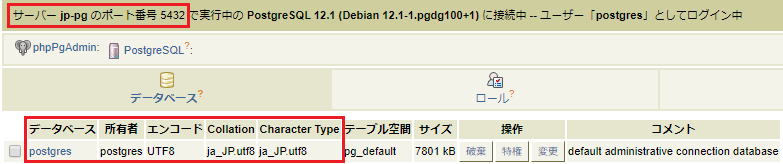

# Docker入門

# ハンズオン

---

### 目次

- はじめに
- 環境の準備
- Dockerの構成要素
- ハンズオン：Dockerの基本操作
- コンテナの用途
- コンテナ同士の連携
- Docker Compose
- ハンズオン：Composeの作成
- まとめ

---

### はじめに

**このワークショップでは**

Dockerを使用したことがない方へ、Dockerの基本的な使い方から、
Dockerアプリケーションの作成方法まで、ハンズオン形式で解説します。

**前提知識**

Windows 又は MacでCLI操作ができること

---

## 環境の準備

---

### 環境の準備

ハンズオンでは以下のソフトウェアが必要です。

* Docker
 * Windows  
   [Docker Desktop for Windows](https://docs.docker.com/docker-for-windows/install/)  
 * Mac  
   [Docker Desktop for Mac](https://docs.docker.com/docker-for-mac/install/)  

* [Visual Studio Code](https://code.visualstudio.com/)

---

## Dockerの構成要素

---

### コンテナを動かす

コマンドプロンプト(Windows) / ターミナル(macOS)で以下のコマンドを実行してください。

```sh
docker run -d --name pg postgres
```

これで、DockerでPostgreSQLサーバーが起動しました。

---

### コンテナの中に入る

以下のコマンドを実行してください。

```sh
docker exec -it pg bash
# コンテナのOSのプロンプト
root@21321a7c78f9:/# 
```

新しいプロンプトが始まります。これはコンテナのOS(Linux)のプロンプト(bash)です。
psqlコマンドを実行すると、PostgreSQLに接続することができます。

```sh
psql -U postgres
# 出力
psql (12.0 (Debian 12.0-2.pgdg100+1))
Type "help" for help.

postgres=#
```
---

### コンテナとは

**コンテナ**とは、要するに**サーバー**です。
**docker run**コマンドを使うと、PC内にサーバーを起動することができます。
以下のコマンドで実行中のコンテナの一覧が確認できます。

```sh
docker ps
# 出力
CONTAINER ID        IMAGE               COMMAND                  CREATED             STATUS              PORTS               NAMES
c715a39f1989        postgres            "docker-entrypoint.s…"   8 minutes ago       Up 8 minutes        5432/tcp            pg
```

---

### イメージの作成(1/3)

前述の**docker run**コマンドは<a href="https://hub.docker.com/_/postgres">Docker Hub</a>
で公開されているPostgreSQLの**Dockerイメージ**でコンテナを起動しています。

**Dockerイメージ**は公開されているイメージをカスタマイズして作ることもできます。

以下のコマンドを実行し、jp-pgディレクトリとDockerfileファイルを作成してください。

```sh
mkdir jp-pg
cd jp-pg
code Dockerfile
```

---

### イメージの作成 (2/3)

VSCodeがDockerfileを開いたら以下の内容を貼り付けてください。

```docker
FROM postgres
RUN localedef -i ja_JP -c -f UTF-8 -A /usr/share/locale/locale.alias ja_JP.UTF-8
ENV LANG ja_JP.utf8
```

---

### イメージの作成 (3/3)

Dockerfileを保存し、以下のコマンドを実行してください。

```sh
docker build -t jp-pg .
```

これで、**ロケールを日本に変更したPostgreSQL**のイメージが作成できました。

---

### 作成したイメージでコンテナを起動

以下のコマンドでコンテナを起動してください。

```sh
docker run -d --name jp-pg jp-pg
```

コンテナが起動したら、以下のコマンドを実行してください。

```sh
docker exec -it jp-pg bash
# コンテナのプロンプトで
psql -U postgres
# 出力
psql (12.0 (Debian 12.0-2.pgdg100+1))
"help"でヘルプを表示します。

postgres=#
```

ログインメッセージが日本語になっています。

---

### イメージとは

**イメージ**は、要するに**サーバーのインストールメディア**です。

イメージを作っておけば、OSやアプリケーションがセットアップされた状態のコンテナを即座に作成することができます。

```sh
docker images
# 出力
REPOSITORY          TAG                 IMAGE ID            CREATED             SIZE
jp-pg               latest              a78ef5e0a592        36 seconds ago      398MB
postgres            latest              9eb7b0ce936d        2 days ago          394MB
```

---

### ボリュームのマウント(1/4)

コンテナの起動時に外部ファイルを参照する、コンテナのデータを外部に保存するためには、**ボリューム**を使用します。

以下のコマンドを実行し、initdbディレクトリとinitialize.sqlを作成してください。


```sh
cd ..
mkdir initdb
code initdb/initialize.sql
```

---

### ボリュームのマウント(2/4)

VSCodeがinitialize.sqlを開いたら以下の内容を貼り付けてください。

```sql
CREATE USER myuser;
CREATE DATABASE mydb;
GRANT ALL PRIVILEGES ON DATABASE mydb TO myuser;
```

---

### ボリュームのマウント(3/4)

initialize.sqlを保存し、以下のコマンドでコンテナを起動してください。

```sh
# Windows
docker run -d --name mnt-pg -v %cd%/initdb:/docker-entrypoint-initdb.d -v pg_data:/var/lib/postgresql/data jp-pg

# Mac
docker run -d --name mnt-pg -v ${PWD}/initdb:/docker-entrypoint-initdb.d -v pg_data:/var/lib/postgresql/data jp-pg
```

---

### ボリュームのマウント(4/4)

以下のコマンドを実行してください。

```sh
docker exec -it mnt-pg bash
# コンテナのプロンプトで
psql -U myuser mydb
# 出力
psql (12.1 (Debian 12.1-1.pgdg100+1))
"help"でヘルプを表示します。

mydb=>
```

myuserでmydbにログインできます。

---

### ボリュームとは

**ボリューム**とは、要するに**外付け記憶媒体**です。

ボリュームをコンテナにマウント(接続)することで、
コンテナ内に外部からデータを持ち込んだり、コンテナ内のデータを外部に持ち出すことができます。

---

### ボリュームの種類

<dev style="font-size:0.9em;">

ボリュームは共有ディレクトリとNamedVolumeの、2種類の使い方があります。

* 共有ディレクトリ  
オプションを**-v [ホストOSのパス]:[ディレクトリ]**と指定すると、
ホストOSとコンテナの共有ディレクトリとして扱うことができます。

* NamedVolume  
オプションを**-v [任意の名前]:[ディレクトリ]**と指定すると、**NamedVolume**と呼ばれるボリュームをマウントします。
ホストOSからボリューム内のファイル操作ができないので、データを安全に保存することができます。
NamedVolumeは以下のコマンドで確認できます。
```sh
docker volume ls
# 出力
DRIVER              VOLUME NAME
local               pg_data
```

</dev>

---

## ハンズオン
## Dockerの基本操作

---

### 課題

以下の課題を通してDockerの基本操作を学びます。

1. pgコンテナのログを表示する。

2. mnt-pgの/docker-entrypoint-initdb.d/initialize.sqlをホストOSにコピーする。

3. initialize.sqlをpgコンテナの/tmpにコピーして実行する。  
(実行コマンド：psql -U postgres -f /tmp/initialize.sql)

4. pgコンテナのbashを経由せずに、PostgreSQLにmyuserユーザーでmydbにログインする。
(ログインコマンド：psql -U myuser mydb)

5. pg、jp-pg、mnt-pgコンテナを停止、削除する。

---

### 基本操作(1/4)

・ログの表示

```sh
# ログを表示してプロンプトに戻る
docker logs [コンテナ名]
# プロンプトに戻らずログを表示し続ける(Ctrl+cで停止)
dokcer logs -f [コンテナ名]
```

・コンテナでのコマンド実行

```sh
# コマンドを実行してプロンプトに戻る
docker exec [コンテナ名] [実行コマンド]
# bash/psql等のターミナルを操作
docker exec -it [コンテナ名] [ターミナル]
```

---

### 基本操作(2/4)

・作成済みコンテナの起動

```sh
docker start [コンテナ名]
```

・起動中コンテナの停止

```sh
docker stop [コンテナ名]
```

・停止中コンテナの削除

```sh
docker rm [コンテナ名]
```

---

### 基本操作(3/4)

・ファイルコピー

```sh
# ホストOSからコンテナへコピー
docker cp [ファイルパス] [コンテナ名]:[コピー先ディレクトリ]
# コンテナからホストOSへコピー
docker cp [コンテナ名]:[ファイルパス] [コピー先ディレクトリ]
```

・イメージの確認

```sh
docker images
```

・イメージ削除

```sh
docker rmi [イメージ名]
```

---

### 基本操作(4/4)

・ボリューム確認

```sh
docker volume ls
```

・ボリュームを指定して削除

```sh
docker volume rm [ボリューム名]
```

・ヘルプを表示

```sh
docker help
docker [Management Commands] help
```

---

## それでは

## 作業を始めてください

---

## コンテナの用途

---

### コンテナの用途

コンテナは以下の用途で使用できます。

* サーバー  
ここまでで触ってきたようにコンテナをサーバーとして運用することができます。
コンテナを削除すると保存したデータも削除されますが、ボリュームを使用することでデータを永続化できます。

* 単独処理  
dokcer runに**--rm**オプションを追加すると、コマンド終了時にコンテナを削除することができます。
このオプションを利用することで、コンテナ単独での処理が可能です。

---

### 単独処理の例

以下のコマンドを実行してください。

```sh
# Windows
docker run --rm -v pg_data:/target -v %cd%:/backup postgres tar cfz /backup/pg_data.tar.gz -C /target .
dir pg_data.tar.gz

# Mac
docker run --rm -v pg_data:/target -v ${PWD}:/backup postgres tar cfz /backup/pg_data.tar.gz -C /target .
ls pg_data.tar.gz

# 共通：コマンド完了後
docker ps -a
```

pg_dataボリュームのデータをバックアップすることができました。
別の端末にバックアップをコピーしてコンテナでマウントすることで、同一の環境を構築することができます。

---

## コンテナ同士の連携

---

### コンテナ同士の連携(1/2)

Dockerでは複数のコンテナを連携することができます。
以下のコマンドで、PostgreSQL、phpPgAdminを起動してください。

```sh
docker run -d --name jp-pg jp-pg
docker run -d --name pgadmin -p 80:80 --link jp-pg:jp-pg -e PHP_PG_ADMIN_SERVER_HOST="jp-pg" -e PHP_PG_ADMIN_SERVER_PORT=5432 dockage/phppgadmin
```

ブラウザで<a href="http://localhost">http://localhost</a>にアクセスすると、phpPgAdminが表示できます。

---

### コンテナ同士の連携(2/2)

phpPgAdminが開いたら、"サーバー > PosgreSQL"をクリックして、"ユーザー名:postgres/パスワード:[空欄]"でログインしてください。

jp-pgコンテナにログインすることができます。



---

## Docker Compose

---

### Docker Composeとは

前述の連携環境はPostgreSQL、phpPgAdminのコンテナを個別に起動しました。

**Compose**を使用することで複数のコンテナを一括で起動することができます。
同様の連携環境をComposeで構築することで、Composeの構築方法を学びます。

---

### Composeファイル

Composeで起動するコンテナは**docker-compose.yml**で管理します。
PostgreSQLを起動する場合は以下のように記述します。

```yml
version: "3.7"

services:
  pg:
    image: postgres
    volumes:
      - pg_data:/var/lib/postgresql/data
    port:
      - 5432:5432

volumes:
  pg_data:
```

上記内容の詳細と、他に記述できる内容は
<a href="http://docs.docker.jp/compose/compose-file.html">Composeファイル・リファレンス</a>
を参照してください。

---

### Composeの基本コマンド(1/2)

docker-compose.ymlのあるディレクトリで、以下コマンドを実行するとComposeを操作できます。

・Composeの起動

```sh
docker-compose up -d
```

・Composeの停止

```sh
docker-compose stop
```

・作成済みComposeの起動

```sh
docker-compose start
```

・コンテナの確認

```sh
docker-compose ps
```

---

### Composeの基本コマンド(2/2)

その他のコマンドは、以下のヘルプと
<a href="http://docs.docker.jp/compose/reference/overview.html">docker-composeコマンド概要</a>
を参照してください。

・ヘルプを表示

```sh
docker-compose help
```

---

## ハンズオン
## Composeの作成

---

### ハンズオンの事前準備

以下コマンドでPostgreSQL、phpPgAdminのコンテナを停止・削除してください。

```sh
docker stop pgadmin jp-pg
docker rm pgadmin jp-pg
```

---

### 課題

<div style="font-size:0.9em;">

以下のComposeを作成してください。

* PostgreSQL
 * jp-pgのDockerfileからイメージを作成して起動する
 * initdb/initialize.sqlを起動時に実行する
 * /var/lib/postgresql/dataにNamedVolumeをマウントする

* phpPgAdmin
 * dockage/phppgadminからコンテナを作成
 * PostgreSQLの起動を待って起動する
 * jp-pgコンテナの5432ポートに接続する
 * 80ポートでアクセス可能とする

作成できたらブラウザで<a href="http://localhost">http://localhost</a>にアクセスして、
myuserでPostgreSQLにログインできることを確認してください。

</div>

---

## それでは

## 作業を始めてください

---

## まとめ

---

### まとめ

* Dockerの構成要素
 * イメージからコンテナを構築してサーバーとして運用
 * コンテナにボリュームをマウントすることでデータを永続化
* コンテナでできること
 * サーバーとして運用可能
 * オプションの指定で単独処理が可能
* Dockerfileを用意することで独自のイメージを作成できる
* Composeにより、複数コンテナが連携するDockerアプリケーションを作成できる
 * 弊社プロダクト[sit-ds](https://github.com/sitoolkit/sit-ds)もComposeで実装
 * Jenkins, Redmine, Gitbucket, Sonarqube, Artifactoryのアセット
 * 各種アプリケーションサーバーはLDAP認証 + SelfServicePasswordでPW一括管理
 * バックアップ・リストアをDocker単独処理で実現

---

### 付録：各種リファレンスへのリンク

<a href="http://docs.docker.jp/engine/reference/commandline/index.html">Dockerコマンド</a>

<a href="http://docs.docker.jp/engine/reference/builder.html">Dockerfileリファレンス</a>

<a href="http://docs.docker.jp/compose/compose-file.html">Composeファイル・リファレンス</a>

<a href="http://docs.docker.jp/compose/reference/overview.html">docker-composeコマンド概要</a>

---

### ご清聴ありがとうございました。

### ハンズオンお疲れさまでした。